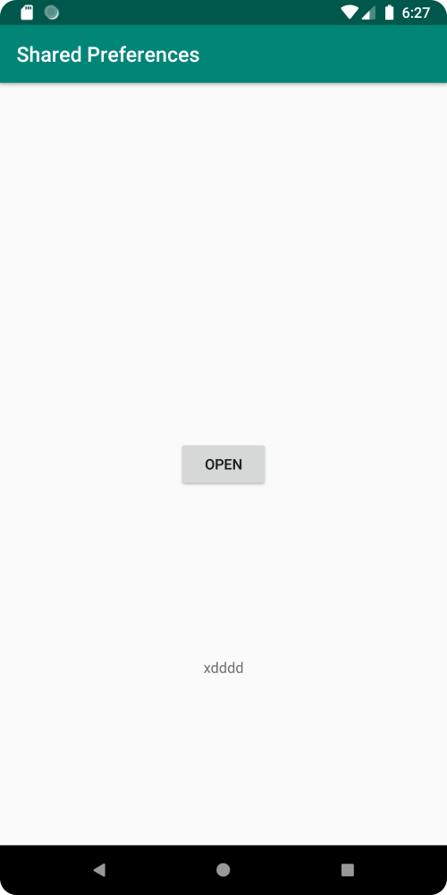
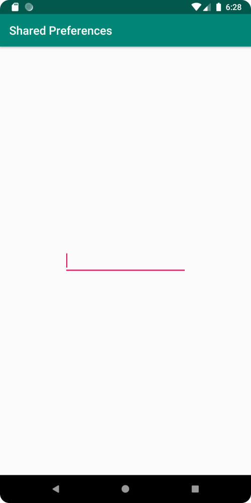

# Rapport

Först skapades en Shared Preferences instans inuti MainActivity.
Detta ger möjligheten att läsa data genom Shared Preferences.

Koden ser ut som följande inuti "MainActivity.java":

````
private SharedPreferences myPreferenceRef;
myPreferenceRef =  getSharedPreferences("myPreferenceRef", MODE_PRIVATE);
````

Sedan skapades en till activity "SecondActivity".
En knapp skapades även som öppnar SecondActivity från MainActivity.

Koden ser ut som följande inuti "activity_main.xml":

````
<Button
    android:id="@+id/button"
    android:layout_width="wrap_content"
    android:layout_height="wrap_content"
    android:text="Open"
    app:layout_constraintBottom_toBottomOf="parent"
    app:layout_constraintEnd_toEndOf="parent"
    app:layout_constraintStart_toStartOf="parent"
    app:layout_constraintTop_toBottomOf="@+id/appBarLayout" />
````

Koden ser ut som följande inuti "MainActivity.java":

````
button.setOnClickListener(new View.OnClickListener() {
    @Override
    public void onClick(View view) {
        Intent intent = new Intent(MainActivity.this, SecondActivity.class);
        startActivity(intent);
    }
});
````

Sedan skapades en EditText till "SecondActivity", och en TextView till "MainActivity".
EditText widgeten tillåter användaren att skriva in text som sedan skall visas inuti en TextView widgeten.

Koden ser ut som följande inuti "activity_second.xml":

````
<EditText
    android:id="@+id/editText"
    android:layout_width="wrap_content"
    android:layout_height="wrap_content"
    android:ems="10"
    android:inputType="text"
    android:minHeight="48dp"
    app:layout_constraintBottom_toBottomOf="parent"
    app:layout_constraintEnd_toEndOf="parent"
    app:layout_constraintStart_toStartOf="parent"
    app:layout_constraintTop_toTopOf="parent" />
````

Koden ser ut som följande inuti "activity_main.xml":

````
<TextView
    android:id="@+id/data"
    android:layout_width="wrap_content"
    android:layout_height="wrap_content"
    android:text="No Data!"
    app:layout_constraintBottom_toBottomOf="parent"
    app:layout_constraintEnd_toEndOf="parent"
    app:layout_constraintStart_toStartOf="parent"
    app:layout_constraintTop_toBottomOf="@+id/button" />
````

EditText widgeten använder en listener för att hämta texten och spara den i Shared Preferences.

Koden ser ut som följande inuti "SecondActivity.java":

````
private SharedPreferences sharedPreferences;
private SharedPreferences.Editor sharedPreferencesEditor;
private EditText editText;

protected void onCreate(Bundle savedInstanceState) {
    sharedPreferences = getSharedPreferences("myPreferenceRef", MODE_PRIVATE);
    sharedPreferencesEditor = sharedPreferences.edit();
    editText = findViewById(R.id.editText);

    editText.addTextChangedListener(new TextWatcher() {
        @Override
        public void afterTextChanged(Editable editable) {
            String text = editText.getText().toString();
            sharedPreferencesEditor.putString("data", text);
            sharedPreferencesEditor.apply();
        }});
}    
````

Sedan sätts texten inuti TextView widgeten i MainActivity till den hämtade texten.

Koden ser ut som följande inuti "MainActivity.java":

````
private TextView data;

protected void onCreate(Bundle savedInstanceState) {
    data = findViewById(R.id.data);
}    

protected void onResume() {
    super.onResume();
    data.setText(myPreferenceRef.getString("data", "No Data!"));
}
````

MainActivity ser ut som följande:



SecondActivity ser ut som följande:


